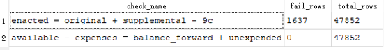
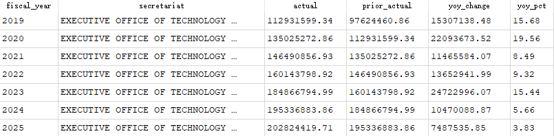
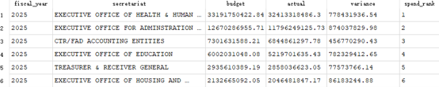
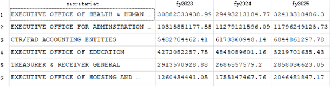
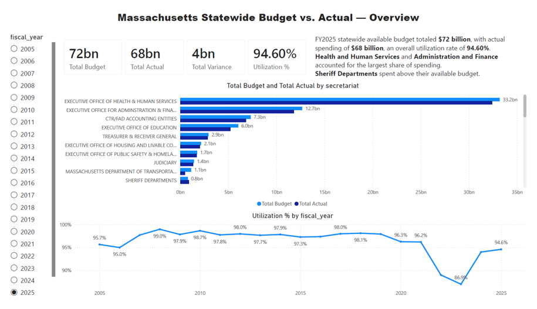
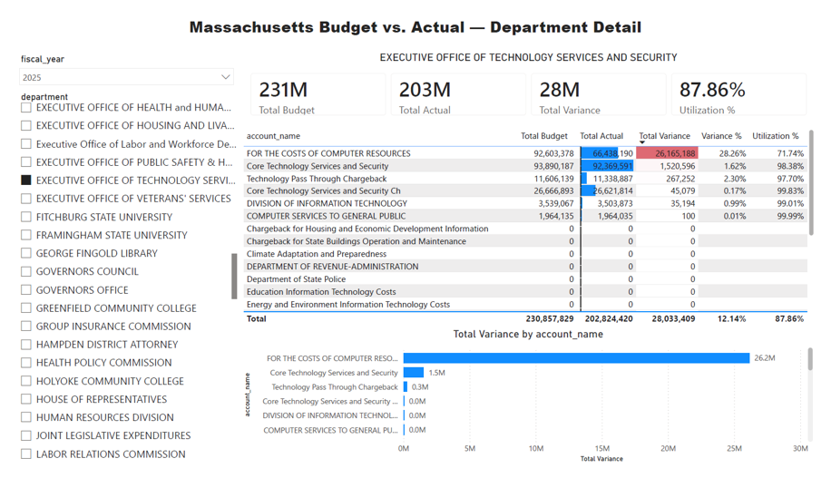

# Massachusetts State Budget Analysis (CTHRU) — SQL + Power BI

Analysis of Massachusetts budget-to-actual data from [CTHRU](https://cthru.mass.gov), the state's official open spending platform run by the Office of the Comptroller.

**Data:** ~48,000 rows, one row per appropriation account per fiscal year (FY2005–FY2027).
Each row carries the enacted budget, transfers, total available, and actual expenses.

## Workflow

1. **Cleaning** — load the raw CSV as plain text, so no values are lost to type guessing. Remove thousands separators, cast to numeric, convert blanks to NULL
   (a blank is missing data, not zero — casting blanks to 0 would distort averages and variance percentages)
2. **Views** — wrap cleaning and variance logic in live views, so the pipeline updates automatically when source data changes
3. **Reconciliation** — turn the accounting identities into automated checks (available = enacted budget + net transfers; available − spent = carried forward + reverted).
   One check flagged ~1,600 rows traced to retained-revenue accounts, which follow a different rule
   
4. **Variance analysis** — variance, variance %, and utilization %, with divide-by-zero guards on the denominator
5. **Year-over-year** — change and % change by secretariat, using LAG
   
7. **Ranking** — departments ranked by spending within each fiscal year, using RANK
   
9. **Report pivot** — fiscal years pivoted into columns with CASE statements for a manager-readable summary layout
   

The Power BI report sits on top of the cleaned views: a statewide overview page (KPI cards, secretariat ranking, 20-year utilization trend) and a department
drill-down page (account-level table with variance measures and conditional formatting). Incomplete fiscal years are excluded from the trend line using a
completeness flag built in SQL.

## Repository contents
- `sql/` — scripts numbered by step
- `images/` — dashboard screenshots

## Notes and limits
- The data has fiscal years only, no months, so no monthly trend is possible
- Single source table; no joins in this dataset
- Variance is budget vs. actual, not actual vs. forecast

**Tools:** SQLite (DB Browser for SQLite), Power BI
